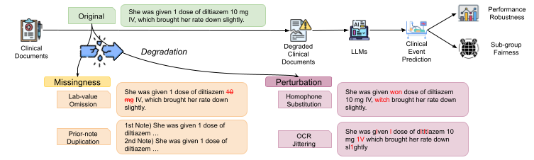

# Towards Robust and Fair Next Visit Diagnosis Prediction with LLMs under Noisy Clinical Notes

Official Implementation of **Towards Robust and Fair Next Visit Diagnosis Prediction with LLMs under Noisy Clinical Notes.**<br/>

## Abstract
A decade of rapid advances in artificial intelligence (AI) has opened new opportunities for clinical decision support systems (CDSS), with large language models (LLMs) demonstrating strong reasoning abilities on timely medical tasks. However, clinical texts are often degraded by human errors or failures in automated pipelines, raising concerns about the reliability and fairness of AI-assisted decision-making. Nevertheless, the impact of such degradations on LLMs still remains under-investigated. In this paper, we present the systematic study of state-of-the-art LLMs under diverse text corruption scenarios, focusing on robustness and equity with the focus on next visit diagnosis prediction. We identify a central challenge in prior works: the vast diagnostic label space, which complicates zero-shot prediction. To address this, we introduce a clinically grounded label-reduction scheme and a hierarchical chain-of-thought (CoT) prompting strategy that emulates clinicians’ reasoning. By doing so, our approach shows an improvement on both robustness and fairness, advancing the reliable use of LLMs in CDSS. We will release code publicly available upon acceptance.


## Main Figure



Please refer to the paper for additional details.

## Prerequisites

Follow these steps to set up your environment and prepare the necessary datasets.

### Environments
`Python 3.9.xx`

### Environmental set-up

```
pip install torch==2.0.1 torchvision==0.15.2 torchaudio==2.0.2 --index-url https://download.pytorch.org/whl/cu118
pip install transformers==4.40.0 
```


### Datasets
#### MIMIC-IV Dataset

Download the [MIMIC-IV dataset](http://physionet.org/content/mimiciv/3.1/) and [MIMIC-IV-Note dataset](https://physionet.org/content/mimic-iv-note/2.2/) and unzip them.


Organize them as follows:

```
data/
├── mimic-iv
│   ├── patients.csv.gz
│   ├── admissions.csv.gz
│   ├── diagnoses_icd.csv.gz
│   └── discharge.csv.gz
├── tools
│   ├── ccs_single_dx_tool_2015.csv
│   ├── ccs_multi_dx_tool_2015.csv
│   └── icd10cmtoicd9gem.csv
Evaluation.ipynb
Preprocess_MIMIC_IV.ipynb
prompt.py
query_llm_diag_hierarchy.py
README.md
text_degrade_multi_visit.py
utils.py
```

This repository supports the ```ccs_multi_dx_tool_2015.csv``` and ```ccs_single_dx_tool_2015.csv``` files. 
Their information is available at [CCS Users Guide](https://hcup-us.ahrq.gov/toolssoftware/ccs/CCSUsersGuide.pdf).

## Run

The workflow is divided into preprocessing, optional degradation, and evaluation.

### Step 1: Preprocess MIMIC-IV Dataset

Run the Jupyter Notebook to process the raw MIMIC-IV data:

```
Preprocess_MIMIC_IV.ipynb
```

### Step 2: Degrade MIMIC-IV Dataset
To test model robustness, you can introduce noise and errors into the dataset using this script:

```
python text_degrade_multi_visit.py
```
Please note that Be aware that the homophone degradation method is computationally intensive and may take a long time to complete.

### Step 3: Evaluate LLMs

Run the evaluation script to query the LLMs. You can specify the model, task, and degradation type.

Example Evaluations:
```
# Evaluate on the clean, original dataset
python query_llm_diag_hierarchy.py --task diagnosis_hierarchical --model gemini-2.0-flash

# Evaluate with 100% random lab value erasure
python query_llm_diag_hierarchy.py --task diagnosis_hierarchical --degradation random_lab_values_erasure --ratio 1.0 --model gemini-2.0-flash

# Evaluate with 80% copy-paste from previous visits
python query_llm_diag_hierarchy.py --task diagnosis_hierarchical --degradation copy_paste_from_previous --ratio 0.8 --model gemini-2.0-flash

# Evaluate with 30% OCR corruption
python query_llm_diag_hierarchy.py --task diagnosis_hierarchical --degradation ocr_corrupt_document --ratio 0.3 --model gemini-2.0-flash

# Evaluate with 30% fast homophone replacement
python query_llm_diag_hierarchy.py --task diagnosis_hierarchical --degradation replace_with_homophones_fast --ratio 0.3 --model gemini-2.0-flash
```

You can also switch the model by changing the ```--model``` argument (e.g., ```--model gpt-4o-mini```).


## References (To Be Added)
```

```